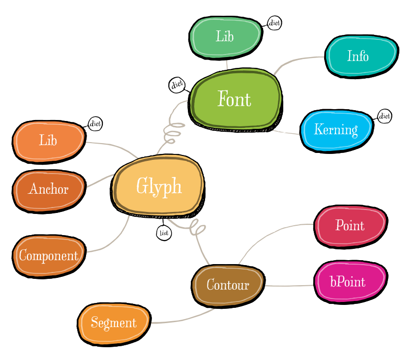

RoboFab Object Model
====================

`RFont <RFont.html>`_ · `RInfo <RInfo.html>`_ · `RGlyph <RGlyph.html>`_ · `RContour <RContour.html>`_ · `RPoint <RPoint.html>`_ · `bPoint <bPoint.html>`_ · `RSegment <RSegment.html>`_ · `RAnchor <RAnchor.html>`_ · `RComponent <RComponent.html>`_ · `RKerning <RKerning.html>`_ · `RLib <libs.html>`_
